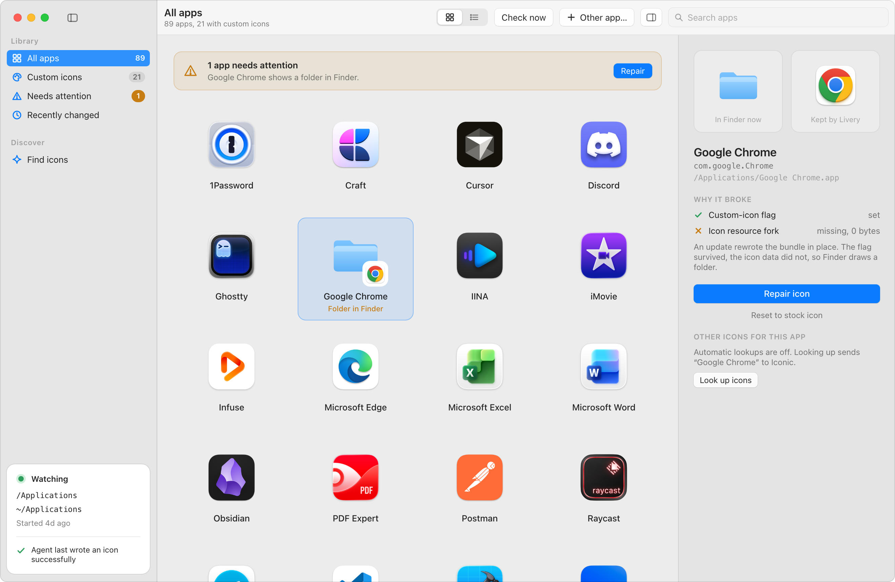

# Livery

<p align="center">
  
</p>

<p align="center">Change the icons of your Mac apps.</p>

<p align="center">English · <a href="README.zh-Hans.md">简体中文</a></p>

<picture>
  <source media="(prefers-color-scheme: dark)" srcset="Design/window-dark.png">
  
</picture>

Livery gives any app in your Applications folder a different icon. Pick one from a catalog of
about 30,000 community-made icons, right in the inspector, or use an `.icns` or `.png` of your own;
one click writes it in. Livery keeps a copy of every icon it applies and puts it back when an app
update wipes it out, so the icons you choose stay chosen. The interface is in English and
Simplified Chinese, following the system language.

## What it does

- **Picks icons.** Select an app and the inspector lists the icons the catalog has for it, most
  downloaded first. Click one and it is downloaded and written into the bundle. *Search more…*
  opens a full search of the catalog; *Choose file…* takes a local `.icns` or `.png`.
- **Puts every icon on the macOS grid.** Catalog artwork often ignores the size and corner radius
  Apple's icons share. Livery measures each icon and scales or clips it so it sits level with its
  neighbours in the Dock. See [Icon grid](#icon-grid).
- **Keeps them there.** App updates routinely strip custom icons. A launch agent watches both
  Applications folders and writes the kept icon back; the app shows what broke and why, and
  repairs it with one click. See [Why icons disappear](#why-icons-disappear-after-updates).
- **Handles apps owned by root.** App Store and pkg installs cannot be written by anything running
  as you. A small privileged helper inside the app does those writes after two one-time
  approvals. See [Permissions](#permissions).
- **Works from a shell too.** `livery` does everything the app does, and imports the icons
  Replacicon manages.

Livery lists every app in `/Applications` and `~/Applications`, one vendor folder deep, so Setapp
and Utilities are included. It is a SwiftUI app, a command line tool and a launch agent over one
core, with no dependencies outside the macOS SDK.

## Requirements

- macOS 15 or later.
- Xcode 16 or later, for the Swift 6 toolchain.
- An Apple Development certificate in your login keychain. Xcode creates one when you sign in
  with any Apple ID under Settings > Accounts; a free account is enough. The install scripts sign
  with it so the permissions below survive rebuilds.

## Build and install

```bash
git clone https://github.com/shuiandy/Livery.git
cd Livery
./install-app.sh
```

`install-app.sh` builds in release, assembles `Livery.app` with the helper inside, signs
everything with your certificate, installs the command line tool to `~/.local/bin/livery`, and
replaces `~/Applications/Livery.app` through a fresh directory before relaunching it. A build that
does not verify or does not start leaves the previous install in place. `./install.sh` on its own
installs only the command line tool and reloads the agent if it is installed.

Without a certificate both scripts stop. `LIVERY_ALLOW_ADHOC=1` lets them sign ad-hoc instead,
at a cost: every rebuild is a new identity to macOS, so every permission has to be granted again,
and the privileged helper is inert because it has no team to trust.

There are no downloadable builds. Handing a bundle to another Mac needs a Developer ID certificate
and notarization, which come with the paid Apple Developer Program; without them Gatekeeper
refuses the download. Building from source takes a minute.

Never `cp` over a running Mach-O in place: the kernel keeps the old code-signing hash on the
vnode and kills every later exec with `OS_REASON_CODESIGNING`. Both scripts replace binaries
through a fresh inode for that reason.

## Using the app

- **Pick an icon.** Select an app. The inspector lists what the catalog has for it, most
  downloaded first; click one to write it. *Search more…* opens a search sheet, *Choose file…*
  takes a local `.icns` or `.png`.
- **Repair.** Apps that need attention are counted in the sidebar and in a banner above the
  grid. *Fix all* repairs them at once; the inspector's *Repair icon* does one.
- **Watch in the background.** Settings > Background agent installs the launch agent. The card
  at the bottom of the sidebar shows what it is watching and whether macOS let it write.
- **Root-owned apps.** Settings > Privileged helper > Set up walks through the two approvals
  macOS wants, each with a status light that reflects what the system actually says.
- **Undo.** *Reset to stock icon* in the inspector puts one app back; Icons > Restore All Stock
  Icons puts every app back and empties the library, keeping the icon files.

The window re-reads every app when it becomes active, every 30 seconds, and whenever the library
changes, so repairs made by the agent or the command line tool show up on their own.

## Command line

```bash
livery search chrome                     # numbered contact sheet opens in Preview (Iconic catalog, no key)
livery set "Google Chrome" --pick 3      # apply the third result and start tracking
livery set Wren --file ~/Downloads/wren.icns
livery list                              # tracked apps with current health
livery check --fix                       # verify every tracked app, rewrite the broken ones
livery reset Wren                        # back to the app's own icon, stop tracking
livery reset --all                       # undo everything
livery import-replacicon --apply         # migrate what Replacicon currently manages
livery agent install                     # launch agent, KeepAlive, log in ~/Library/Logs/livery.log
livery refit --apply                     # rescale kept icons that ignore the macOS icon grid
livery key <KEY>                         # optional: macosicons.com key for --source macosicons
```

`<app>` is a display name, a bundle identifier, or a path to the `.app`. `livery --help` lists
every command and option.

## Permissions

Writing `Icon\r` into another app's bundle is gated by TCC's App Management
(`kTCCServiceSystemPolicyAppBundles`). Interactive shells inherit the grant from the terminal
app; the launch agent and the app each need their own. The app asks the first time it repairs an
icon. For the agent, add `~/.local/bin/livery` under System Settings > Privacy & Security >
App Management once, or the watcher logs "NSWorkspace refused" on every repair.

App Store and pkg installs leave the bundle owned by `root:wheel`, and nothing running as you can
write into one. Livery writes those through `LiveryHelper`, a LaunchDaemon inside the app bundle
registered with `SMAppService`. It exposes exactly two operations, write an icon into a bundle
and remove one, and every XPC connection must satisfy a code-signing requirement naming the team
and identifiers of the build it shipped with, so no other process can drive it. The team is read
out of the helper's own signature at run time and the `com.apple.application-identifier`
entitlement is generated from the signing certificate at build time, so a fork signed with a
different certificate trusts its own app without editing any source.

The helper needs two one-time approvals, both in the UI, no Terminal and no password:

1. **Login Items & Extensions > Allow in the Background**: turn on Livery. This lets the daemon
   run.
2. **Privacy & Security > App Management**: turn on Livery. Nothing has to be added by hand: the
   helper's first request makes macOS create the row and show the standard dialog (the setup
   panel's *Ask macOS* button is exactly one request). tccd attributes the daemon inside the
   bundle to the bundle, so this one row covers the app and its helper.

After that every write is silent, including automatic repairs after an app updates and re-roots
its own bundle. The grant is keyed to the helper's code-signing identity, not to any app's
ownership, so it survives updates of both Livery and the apps it manages.

The second step is needed because a LaunchDaemon runs with audit user 0, where TCC resolves App
Management against the system database while System Settings writes grants to the user's. The
helper calls `audit_session_port` and `audit_session_join` to join the calling user's audit
session, which moves the lookup into that user's database, where the grant lives. Without that
join tccd answers `auth_value absent` no matter what the user approves.

## Privacy

Livery talks to the network for two things and nothing else: looking up icons by app name, and
downloading the icon you picked. There is no analytics, no crash reporting, no update check.

Selecting an app sends its name, and nothing else, to the catalog so the inspector can show icons
for it. Settings > Icon catalog turns that off; lookups then happen only when you click *Look up
icons* or *Search more…*.

## Why icons disappear after updates

A custom icon on a `.app` is two separate things: the `kHasCustomIcon` bit in the bundle's
`com.apple.FinderInfo` xattr, and an `Icon\r` file inside the bundle whose resource fork holds the
artwork. Updaters that rewrite the bundle in place (Setapp, Keystone, pkg installers) keep the
directory and its xattrs but drop `Icon\r`. Finder then trusts the bit, finds no data, and draws a
generic folder. A tool that only checks the bit considers those apps fine and never repairs them.

Livery checks both halves and rewrites the icon whenever either is missing. It also handles the
other failure, a bundle replaced wholesale, which clears the bit and brings the stock icon back.
The launch agent follows both Applications folders with FSEvents and sweeps every ten minutes, so
a repair usually lands before you notice the folder.

## State and safety

State lives in `~/Library/Application Support/Livery/`: the kept icons and `manifest.json`.

The manifest is written by three processes: the app, the command line tool and the watcher. Every
read-modify-write goes through one exclusive `flock` held for the whole cycle, so none of them can
drop another's entries. A manifest that will not parse is moved aside and recovered from
`manifest.backup.json` rather than treated as an empty library, and one written by a newer format
is refused instead of overwritten.

Changing an icon is one transaction under that lock: the new icon is staged under a name of its
own, the previous kept icon is set aside, the manifest entry is written, and only then is the
bundle written. A failed bundle write puts the kept icon and the entry back; a process that dies
in between leaves an entry `check --fix` completes. The library never records an icon Finder does
not show. Leftovers from an interrupted write are swept at launch.

A tracked app is identified by the bundle identifier in its `Info.plist`, not by its path, so a
different app installed under the old name is not written into. That identifier comes out of
someone else's bundle and is used as a file name, so it is sanitised first: anything outside
`[A-Za-z0-9._-]` is folded and a digest is appended to keep distinct identifiers distinct.

The helper resolves every link in a path before judging it, accepts only real bundles at most one
vendor folder deep inside `/Applications` or the caller's own `~/Applications`, reads an icon
file only if it is a regular file with an icns or PNG header, joins the caller's audit session or
refuses the write, and does one write at a time.

Downloads are pinned to HTTPS, redirects are re-checked rather than followed blindly, hosts whose
name or resolved addresses point at this machine or a private network are refused, a reply is cut
off the moment it passes its size cap, and the image canvas is capped.

`swift test` covers the manifest under concurrent writers, corruption and mid-transaction
failure, restore-all, path sanitising, bundle identity, the icon grid rules, the helper's input
validation including links and pipes, and the network guards.

## Icon grid

macOS artwork sits on a grid: a rounded tile covering 824 of the 1024 pt canvas, with a corner
radius of 185 pt and a margin the Dock relies on for even spacing. Community catalogs are full of
artwork that ignores it: square stickers painted edge to edge, or tiles that fill the whole
canvas. Written as-is they render larger and squarer than every neighbouring icon.

Livery measures the opaque bounding box of every icon it stores. Artwork covering more than 90%
of the canvas is scaled onto the tile, and artwork whose own corners are painted is clipped to
the rounded shape. Icons that already follow the grid are stored byte for byte. The thumbnails
in the app run through the same code, so the preview is what gets written. `livery refit`
reports stored icons that miss the grid and `livery refit --apply` corrects them.

## Uninstall

1. Settings > Background agent: turn it off, or run `livery agent uninstall`.
2. Settings > Privileged helper > Remove, or `open ~/Applications/Livery.app --args --remove-helper`.
3. `livery reset --all` if you want every app back on its own icon.
4. Delete `~/Applications/Livery.app`, `~/.local/bin/livery`, `~/Library/Application Support/Livery`,
   `~/Library/Caches/Livery`, `~/Library/Logs/livery.log` and `~/.config/livery`.

The rows Livery left in Login Items and App Management can be removed from System Settings by
hand.

## Building a fork

The identifiers are `com.shuiandy.Livery` (app), `com.shuiandy.Livery.helper` (helper and its
mach service) and `com.shuiandy.livery` (command line tool and launch agent). They are defined in
one place each and the helper derives the identifiers it trusts from its own, so renaming is a
search and replace. The trusted team is never in source: it comes from whatever certificate
signed the build.

## Credits

Icons come from two catalogs that serve the same community library of about 30,000 icons:
[Iconic](https://icons.ahmetdedeler.com) by Ahmet Dedeler, which needs no key and is the
default, and [macosicons.com](https://macosicons.com), which needs a free key and allows 50
calls a month on the free plan. Every icon there belongs to the person who drew it. Livery
downloads the one you pick, on your behalf, and does not redistribute any of them.

## Known limitations

- No downloadable builds, for want of a Developer ID certificate. Build from source.
- Resetting an app goes back to its stock icon; there is no undo to the icon it had before.
- The private-network check on downloads happens at lookup time. A record that changes between
  the lookup and the connection is outside what a client can see; the catalog hosts are fixed.

## License

MIT. See [LICENSE](LICENSE).
